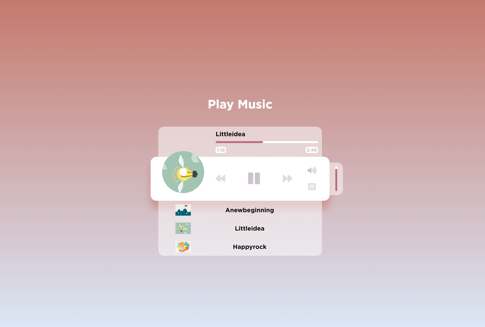

# Music Player

Create a music player UI to play songs stored in the "music" folder using CSS / JS / HTML5 audio API.

Inspired by -> Brad Traversy: <https://youtu.be/QTHRWGn_sJw>

## Project Specifications

- Create UI for music player with
  - a spinning cover image
  - a song detail popup
- Add play and pause functionality
- Switch songs
- Progress bar

## Extra Features Added

- Show playback time with the progress bar
- Adjust Volume
- Show/Hide playlist
  - User can click the song from playlist to play/pause
